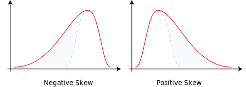
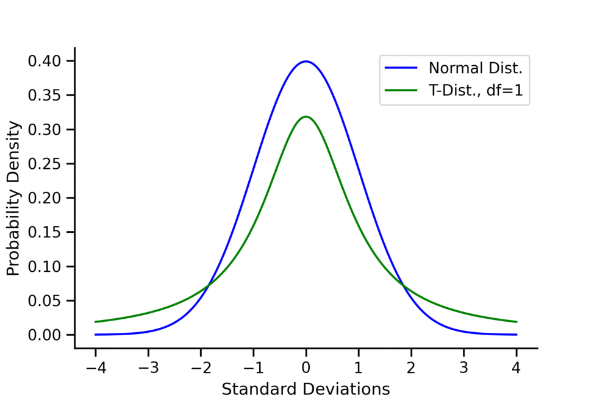
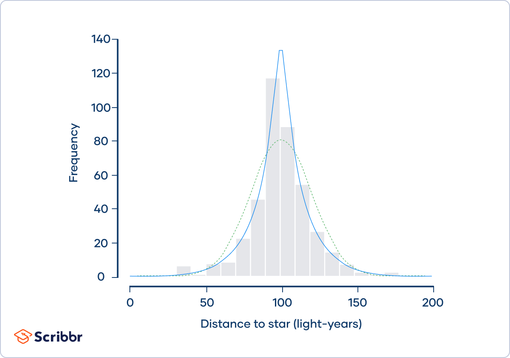

<SCRIPT language="JavaScript" SRC="my_jxscript.js"></SCRIPT>

<style>
/* Long Fig caption justify alignment */
.caption {
  margin: auto;
  text-align: left;
}
</style>

\newcommand{\indep}{\perp \!\!\! \perp}

<a class="top-link" href="#top" id="js-top">↑</a>


```{r setup, include=F, echo=F}
library(knitr) # load packages
library(kableExtra)
library(tidyverse)
library(latex2exp)
library(stargazer)
library(bookdown)

# don't show code unless we explicitly set echo = TRUE
opts_chunk$set(echo = TRUE, message=FALSE, fig.align="center", fig.pos = "H")
opts <- options(knitr.kable.NA = "")

## control long outputs by using eg `max.lines = 10`
hook_output_default <- knitr::knit_hooks$get('output')
truncate_to_lines <- function(x, n) {
   if (!is.null(n)) {
      x = unlist(stringr::str_split(x, '\n'))
      if (length(x) > n) {
         # truncate the output
         x = c(head(x, n), '...\n')
      }
      x = paste(x, collapse = '\n') # paste first n lines together
   }
   x
}
knitr::knit_hooks$set(output = function(x, options) {
   max.lines <- options$max.lines
   x <- truncate_to_lines(x, max.lines)
   hook_output_default(x, options)
})
```


**Econometrics**

-   Use of statistical methods to analyse economic data, and to study economic relationships.
-   This includes testing economic theories, quantifying relationships, making predictions about counterfactual scenarios, and forecasting future outcomes.
-   Econometric practice.
-   Econometric theory.

**Types of Data**

-   Cross-section - observations on units at some point in time
    -   Examples: earnings of individuals; exam results of schools; GDP per capita of countries
-   Time-series - observations on same unit at different points in time
    -   Examples: quarterly GDP; monthly unemployment; daily exchange rates
-  Panel data - repeated observations over time on same units (or time-series data for multiple units)
    -   Examples: household expenditures; production of manufacturing firms; growth of OECD countries
-  Data sources - many and varied
    -   Examples: national statistical agencies; international organisations; company accounts; tax returns (anonymised); household surveys; fieldwork
-  Some data issues - imperfect measurement; quantity measured ̸= quantity of interest; missing values; non-random samples

**Course Aims**: statistical foundations, fundamental concepts, and basic methods for cross-section data.

- linear regression using cross-section data, 
- hypothesis testing, 
- properties of estimators and large-sample theory.

___ 

# Random Variables, Probabilities, Kolmogorov's Axioms

## Random Variables

- Key concept used to describe outcomes which are uncertain.
- Example: Coin toss.
    - two possible outcomes: heads or tails 
    - let $X=0$ if heads and $X=1$ if tails 
    - $X$ is a random variable
- More generally, a numerical representation or quantitative function of the possible outcomes.
- After the event, the observed outcome is the realized value or realization of the random variable.


**Discrete random variables** take a finite number of possible values.

Simplest case: only 2 possible values. Binary random variables (e.g. $X$ in the previous slide)

- is an individual employed or not?
- is a country an oil exporter or not?

Can be more than two outcomes. 

- which mode of transport (walking, cycling, car, bus, train,. . . ) does an individual use to travel between home and work?
- which brand of breakfast cereal did I eat this morning?


**Continuous random variables** may take infinitely many possible values.

Examples: 
- height of students in our class; 
- time interval between successive transactions in a financial market.


## Probabilities

**Probabilities** are used to describe the behavior of random variables.

Example: if we toss a fair coin and define the binary random variable $X$ as before, then we
have

$$
\mathbb{P}(X=0) = \mathbb{P}(X=1) = \frac{1}{2}
$$
Both probabilities lie between zero and one, and sum to one, as there are only 2 possible outcomes.


More generally, for discrete random variables, we denote the probability of outcome x using $\mathbb{P}(X = x)$ — sometimes written as $\text{P}(X = x)$ or $\text{Pr}(X = x)$.

<span style='color:#337ab7'>Standard convention</span>: Capital letters denote the random variable, lower case letters denote a particular realization of the random variable.

- For continuous random variables, the probability of any single outcome is equal to **zero**.
- For continuous random variables we focus on interval probabilities, e.g.

$$
\mathbb{P}(\text{height}>6 \text{ feet}), \qquad \mathbb{P}(5000 \text{ kr}\le \text{weekly wage} < 6000 \text{ kr}), 
$$

## Kolmogorov's axioms

For a discrete random variable Y which may take one of $K$ possible <span style='color:#008B45FF'>*mutually exclusive*</span> (or <span style='color:#008B45FF'>*disjoint*</span>) outcomes denoted by $y_1, y_2, \ldots, y_K,$ any potential set of probabilities should satisfy Kolmogorov’s axioms:

1. $\mathbb{P}(Y=y_i)\ge 0$, for $j=1,2,\ldots,K.$
2. $\mathbb{P}(Y=y_1 \text{ or } Y=y_2 \text{ or } \ldots \text{ or } Y=y_K)=1.$
3. $\mathbb{P}(Y=y_j \text{ or } Y=y_k) = \mathbb{P}(Y=y_j) + \mathbb{P}(Y=y_k)$ for $j\ne k.$

Note: 

- <span style='color:#008B45FF'>Mutually exclusive</span> means that the events cannot occur at the same time. Formally said, $X$ is a set of mutually exclusive events <span style='color:#337ab7'>if and only if</span>

<div class = "boxed">

Given any $E_i, E_j \in X$, if $E_i \ne E_j$ then 
$$E_i \cap E_j = \varnothing$$
</div>

- As a consequence, mutually exclusive events have the property: $P(A\cap B)=0.$

This set of axioms can be generalized to apply to probabilities involving <span style='color:#008B45FF'>continuous random variables</span>.

For each *event* $E$ in the *sample space* $\Omega$,

1. $\mathbb{P}(E)\ge 0$ for all $A\in \Omega .$
2. $\mathbb{P}(\Omega)=1.$ Probability of the sample space $\Omega$ is one.
3. If $E_1, E_2, E_3, \cdots$ are disjoint events, then
$$\mathbb{P}(E_1\cup E_2\cup E_3 \cdots)=\mathbb{P}(E_1)+\mathbb{P}(E_2)+\mathbb{P}(E_3)+\cdots$$
For instance, if the random variable $W$ represents weekly wages in kr, and we consider the mutually exclusive events
$$
5000 \text{ kr} \le W < 5500 \text{ kr}  \qquad 5500 \text{ kr} \le W < 6000 \text{ kr} 
$$
then
$$
\begin{align}
&\text{P}(5000 \text{ kr} \le W < 5500 \text{ kr or } 5500 \text{ kr} \le W < 6000  \text{ kr}) \\
=\, &\text{P}(5000 \text{ kr} \le W < 5500 \text{ kr}) + \text{P}(5500 \text{ kr} \le W < 6000 \text{ kr})
\end{align}
$$
since the two events are mutually exclusive.


___

```{example, ex1}
In a presidential election, there are four candidates. Call them A, B, C, and D. Based on our polling analysis, we estimate that A has a 20 percent chance of winning the election, while B has a 40 percent chance of winning. What is the probability that A or B win the election?
```


<button onclick="myFunction('myDIV')">Solution1</button>

<div id="myDIV" style="display: none; color: blue;">
  $$
  \begin{aligned}
  P(\textrm{A wins or B wins}) 
  &= P\big(\{\textrm{A wins}\} \cup \{\textrm{B wins}\}\big) \\
  &= P(\{\textrm{A wins}\})+ P(\{\textrm{B wins}\}) \\
  &= 0.2 + 0.4 \\
  &= 0.6
  \end{aligned}
  $$
</div>


<!------------------------------------------------------------------------>

___

# Sample vs. Population

- In econometrics, the distinction between <span style='color:#008B45FF'>sample</span> and <span style='color:#008B45FF'>population</span> is very important. 

- In general, any object that can be calculated based on observed quantities is a sample quantity.

-  Describing the idea of population requires some more definitions but for the time being suffice to say that the central idea is that there is some <span style='color:#008B45FF'>data generating process (DGP)</span> which generates the data that we observe. Any quantity, the calculation of which requires one to know the DGP, is a <span style='color:#008B45FF'>population quantity</span>.


Example: Recording the outcomes from $n$ tosses of a fair coin would give us a sample of data.

- Denote the outcomes of each toss by $X_1, X_2,\ldots,X_n,$ or simply $X_i$ for $i = 1,2,...,n,$ where each $X_i$ takes the value 0 (heads) or 1 (tails), as before, and $n$ is the sample size.

- For example, with $n = 10$, we might observe 4 heads ($X_i = 0$) and 6 tails ($X_i = 1$).

- We refer to $\frac{4}{10}$ as the <span style='color:#008B45FF'>sample frequency</span> of the outcome heads, and $\frac{6}{10}$ as the <span style='color:#008B45FF'>sample frequency</spam> of the outcome tails.


Define the indicator function $\mathbb{I}(X_i=0)$:
$$
\begin{aligned}
\mathbb{I}(X_i=0) = \begin{cases} 
1 & \text{if } X_i=0 \\
0 & \text{if } X_i=1 
\end{cases}
\end{aligned}
$$
Alternatively, you can write $\mathbb{I}(X_i=0) = 1-X_i$. 

## Sample estimators

- The sample frequency of the outcome 0 then corresponds to the sample average of the indicator function:
$$
\hat{f}(0) = \hat{f}(X_i=0) = \frac{1}{n}\sum_{i=1}^n \mathbb{I}(X_i=0)
$$
- <span style='color:#337ab7'>Notational convention</span>: It is common to add a “hat” (∧) to sample objects which mimic or estimate an unknown population object.

- In the previous example, the indicator $\mathbb{I}(X_i = 0)$ takes the value 1 in 4 of the 10 cases, therefore yielding
$$
\hat{f}(0) = \frac{4}{10}
$$
- Similarly,letting $\mathbb{I}(X_i =1)=1$ if $X_i =1$ and $\mathbb{I}(X_i =1)=0$ if $X_i\ne 1$, we have
$$
\hat{f}(1) = \hat{f}(X_i=1) = \frac{1}{n}\sum_{i=1}^n \mathbb{I}(X_i=1)
$$
In our particular example, 
$$
\hat{f}(0) = \frac{6}{10}.
$$

## Population frequencies

- Consider tossing a coin. Let $X = 0$ correspond to observing heads and $X = 1$ correspond to observing tails. If we know that the coin is fair, then we know that
$$
P(X=0) = P(X=1) = \frac{1}{2}
$$
- This situation reflects a particular belief about the world, that the coin is fair. Such claims/beliefs about the underlying DGP generating the sample data are referred to as claims/beliefs about “the population”.

- In reality, it is usually infeasible to get the population measures. Therefore, we use samples drawn from populations to estimate unknown population quantities.


<!------------------------------------------------------------------------>
___

# Distribution functions

<span style='color:#008B45FF'>Population (cumulative) distribution function (CDF)</span>: For the scalar random variable $X$, the (cumulative) distribution function is
$$
F(x)=P(X\le x).
$$
Also written as $F_X(x)$. 

- The subscript, $X$, denotes the random variable of interest. 
- The argument, $x$, denotes the threshold value which the probability of $X$ smaller or equal to.


Cumulative distribution functions (CDF) exist for both continuous and discrete random variables.

- For discrete random variables, the CDF is a step function.
Cointoss: $X=0$ if heads, $X=1$ if tails. If the coin is fair,then
$$
\begin{aligned}
F(x) = P(X\le x) = 0  \quad & \text{for any } x<0, \\
F(x) = P(X\le x) = \frac{1}{2}  \quad & \text{for any } 0\le x<1, \\
F(x) = P(X\le x) = 1  \quad & \text{for any } x\ge 1. \\
\end{aligned}
$$

- Continuous CDF example. $X\sim \text{Uniform}(a,b)$ has the following CDF:
$$
F(x) = P(X\le x) = \begin{cases}
0 & \text{for any } x<a, \\
\frac{x-a}{b-a} & \text{for any } a\le x<b, \\
1 & \text{for any} x\ge b.
\end{cases}
$$
For continuous random variables the cdf is a continuous function. 

The sample counterpart of the CDF is the empirical distribution function. 
For example, let $W_1,W_2,...,W_n$ denote weekly wages for weeks $1,...,n,$ and define the indicator function 
$$
\begin{aligned}
\mathbb{I}(W_i ≤ w) = 
\begin{cases}
1 & \text{if } W_i ≤ w, \\
0 & \text{if } W_i > w.
\end{cases}
\end{aligned}
$$
The empirical distribution function is
$$
\hat{F}(w) = \frac{1}{n} \sum_{i=1}^n \mathbb{I}(W_i\le w).
$$

- If the underlying random variable is continuous, the empirical distribution function will look less and less like a step function as the sample size increases.
- If the underlying random variable is discrete, the empirical distribution function will still look like a step function as the sample size increases.
- Intuitively, as the *sample size increases*, the empirical distribution function should provide a good approximation to the distribution function of the underlying (discrete or continuous) random variable .

___

# Density functions

<span style='color:#008B45FF'>Probability Density functions (PDF)</span> are derived from CDF.

- PDFs for <span style='color:#337ab7'>discrete random variables</span> (RV) are often referred to as <span style='color:#008B45FF'>probability mass functions (PMFs)</span>. 
$$
f(x) = P(X=x).
$$
Also written as $f_X(x)$.
    - In the coin toss example, 
$$
f(0) = f(1) = \frac{1}{2}.
$$
    - Its relationship with CDF: 
$$
F(x) = P(X\le x) = \sum_{a\le x} f(a)
$$
where the sum is taken over all values of $a\le x$. 

    - <span style='color:#008B45FF'>Bernoulli distribution</span>. If $X\sim \text{Bernoulli}\,(p),$ where $p=0.5$. This corresponds to the fair coin toss with a probability of 0.5 having a head.
    
        Its PMF can be written as
        
        $$
        f(x) = p^x(1-p)^{1-x} \quad \text{where } x\in\{0,1\}.
        $$
        
        That is 
        
        $$
        f(x) = \begin{cases}
        p & \text{if } x=1 \\
        1-p & \text{if } x=0 
        \end{cases}.
        $$
        
        $p$ is called the parameter of the Bernoulli distribution. 
        
        To include the parameter in the notation, one writes $f(x;p)$ instead of $f(x)$.
            
    - <span style='color:#008B45FF'>Binomial distribution</span>, $Y\sim B(n, p)$, is the distribution of the sum of $n$ *independent* Bernoulli trials, $\text{Bernoulli}\,(p)$, each with the same probability $p$.
        $$
        Y=\sum_i^n X_i
        $$
        where $X_i\overset{\text{iid}}{\sim} \text{Bernoulli}\,(p)$. `iid` stands for *independent and identically distributed*.

- For <span style='color:#337ab7'>continuous RV</span>, $f(x)$ can be obtained by differentiating $F(x)$ w.r.t $x$,
$$
f(x) = \frac{\mathrm dF(x)}{\mathrm dx}.
$$
Conversely, CDF can be obtained by integrating the PDF,
$$
F(x) = P(X\le x) = \int_{-\infty}^{x} f(a)\, \mathrm da
$$
    - Example: <span style='color:#008B45FF'>Standard Normal Distribution</span>. If $Z\sim N(0,1)$, then its PDF is given by
$$
\phi(z) = \frac{1}{\sqrt{2\pi}} \exp \left(-\frac{z^2}{2}\right) .
$$
Its CDF is:
$$
\Phi(z) = P(Z\le z) =\int_{-\infty}^z \phi(a)\,\mathrm da.
$$

    - Tail probabilities of the standard normal distribution play an important role in hypothesis testing, and in formulating confidence intervals for parameters of interest.
    - For example, we have $$\Phi(−1.96) = P(Z ≤ −1.96) = 0.025.$$ By symmetry, $$\Phi(1.96) = P(Z ≤ 1.96) = 0.975.$$ Consequently, the probability that any draw from the standard normal distribution will be between $\pm 1.96$ is $95\%$.


```{r fig.cap="The $\\Phi$ and $\\phi$ ($f_Z(.)$) functions (CDF and pdf of standard normal).", out.width="70%", echo=FALSE}
include_graphics("https://drive.google.com/thumbnail?id=1nxfdIKXgZvOqXVSeA3h_hf0yxmsM361l&sz=w1000")
```

**Distribution function visualization tool**: \
<https://seeing-theory.brown.edu/probability-distributions/index.html#section2>

<!------------------------------------------------------------------------>
___

# Quantiles

The quantile function of random variable $X$, $q_{\tau}$, is given by
$$
q_{\tau} = F^{-1}_X(\tau) ,
$$
where $\tau$ is a given probability, and $0\le \tau \le 1$. $F_X^{-1}(\tau)$ denotes the inverse of the cumulative distribution function (CDF) \(F_X(x)\), evaluated at \(\tau\). 

- $q_{\tau}$ is a threshold value so that the probability of $X$ being less or equal than $q_{\tau}$ is $\tau$.
- $q_{\tau}$ can be calculated using the inverse of the CDF.


In other words,
$$
F_X(q_{\tau}) = \mathbb{P}(X\le q_{\tau}) = \tau ,
$$
indicating that the probability of $X$ reaches $q_{\tau}$ is $\tau$.


- Example: Let $Z\sim N(0,1)$. Then we have
$$
\begin{aligned}
q_{0.5} &= 0, \\
q_{0.95} &= 1.645 & \quad & (\text{crit val at the 10% significance level}), \\
q_{0.975} &= 1.960 & & (\text{crit val at the 5% significance level}), \\
q_{0.995} &= 2.576 & & (\text{crit val at the 1% significance level}). \\
\end{aligned}
$$
- Some quantiles have special names:
    - $q_{0.5}$ is the median, or $50^{th}$ percentile.
    - $q_{0.1}$ is the first decile, or $10^{th}$ percentile.
    - $q_{0.25}$ is the first quartile, $25^{th}$ percentile.


<!------------------------------------------------------------------------>
___

# Transformations

Q: If $X \sim N (0, 1)$ then what is the distribution of the new random variable $Y=X^2$?

A: We use transformation -- change of variable formula, to represent the distribution function of $Y$ using distribution function of $X$.

<div class = "boxed">
Let $X$ be a random variable with the distribution function $F_X(x) = P(X \le x).$

Define the new RV $Y=g(X)$, where $g(\cdot)$ is strictly monotone, i.e., strictly increasing or decreasing.

- If $g(\cdot)$ is strictly increasing, then
$$
F_Y (y) = P(Y \le y) = P\left(g(X) \le y\right) = P\left(X ≤ g^{−1}(y)\right) = F_X\left(g^{−1}(y)\right).
$$
- If $g(\cdot)$ is strictly decreasing, then
$$
F_Y(y) = P(Y \le y) = P\left(g(X) \le y\right) = P\left(X \ge g^{−1}(y)\right) = 1−F_X\left(g^{−1}(y)\right) .
$$
</div>

What if $g(\cdot)$ is not strictly monotonic? Solutions exist, but we will not encounter such cases.

---

```{example, ex2}
Let $Y=g(X)=\mu+\sigma X$ where $\sigma>0$. Representing the CDF of $Y$ using $F_X(x)$.
```


<button onclick="myFunction('myDIV2')">Solution2</button>
<div id="myDIV2" style="display: none; color: blue;">
Note that $g(x)$ is strictly increasing in $x$.
The inverse function is
$$
X = g^{-1}(Y) = \frac{Y-\mu}{\sigma}
$$
and so
$$
F_Y(y) = F_X\left(g^{-1}(y)\right) = F_X\left(\frac{y-\mu}{\sigma}\right)
$$
</div>

---


The density function can be obtained by:
$$
f_Y(y) = f_X(g^{-1}(y)) \cdot \left\vert \frac{\partial }{\partial y} g^{-1}(y) \right\vert .
$$
This is known as the <span style='color:#008B45FF'>change of variable formula</span> for density functions. \
`||` denotes the absolute value of the differential. 


Continue with the last example, the density function of $Y$ is:
$$
f_Y(y) = \frac{1}{\sigma} f_X \left(\frac{y-\mu}{\sigma}\right) .
$$
Let $X \sim N(0, 1)$ and let $Y$ be defined as before. Then
$$
\begin{aligned}
f_Y(y) &= \frac{1}{\sigma} \phi \left(\frac{y-\mu}{\sigma}\right) \\
&= \frac{1}{\sqrt{2\pi\sigma^2}} \exp \left(-\frac{(y-\mu)^2}{2\sigma^2}\right) .
\end{aligned}
$$
This is the density function for a normal random variable with mean $\mu$ and variance $\sigma^2$. We write $Y ∼ N(\mu, \sigma^2)$. 


<!------------------------------------------------------------------------>
___

# Moments

- We often summarize properties of distributions using their moments.
- The first moment is called the <span style='color:#008B45FF'>expected value</span> or <span style='color:#008B45FF'>expectation</span>.
    - This is a measure of the central tendency of the distribution of a random variable; other measures of central tendency include the median and the mode.


For a continuous random variable with the density function $f(x)$, the $n^{th}$ order moment is given by
$$
\mathbb{E}(X^n) = 
\begin{cases}
\displaystyle \sum_{x}x^n f(x) & \text{for discrete } X \\
\displaystyle \int_{-\infty}^{\infty} x^n f(x) dx & \text{for continuous } X \\
\end{cases}
$$
if the integral exists.

$\sum_{x}$ denotes the summation over all possible values of $x$.
For discrete RV $x$, we sometimes write $f(x)$ as $P(X=x)$.


## Expectation

Expectation are denoted by $\mathbb{E}(X)$ or $\mathbb{E}_X(X)$ to denote the expectation is taken over the RV $X$.
$$
\mathbb{E}(X) = 
\begin{cases}
\displaystyle \sum_{x}x f(x) & \text{for discrete } X \\
\displaystyle \int_{-\infty}^{\infty} x f(x) dx & \text{for continuous } X \\
\end{cases}
$$

___

```{example, ex3}
Let $X\sim \text{Bernoulli}(p)$. Calculate $\mathbb{E}(X)$.
```


<button onclick="myFunction('myDIV3')">Solution3</button>
<div id="myDIV3" style="display: none; color: blue;">
The PDF of Bernoulli is given by
$$
f(x) = p^x(1-p)^{1-x} \quad \text{where } x\in\{0,1\}.
$$
Hence 
$$
\begin{aligned}
\mathbb{E}(x) &= 0\times P(X=0) + 1\times P(X=1) \\
&= 0 \times (1-p) + 1\times p \\
&= p.
\end{aligned}
$$
</div>

___


A useful property of expected values is that the expectation operator is a <span style='color:#337ab7'>linear operator</span>, meaning that we have
$$\mathbb{E}(a+bX) = a+b\mathbb{E}(X).$$
for any two constants $a$ and $b$.

In general,
$$
\begin{aligned}
\mathbb{E}\left[\sum_{i=1}^n (a_i+b_iX_i) \right] &= \sum_{i=1}^n \mathbb{E}(a_i+b_iX_i)  \\
&= \sum_{i=1}^n \left(a_i+b_i\mathbb{E}(X_i) \right)
\end{aligned}
$$

___

```{example, ex4}
Let $X\sim N(0,1)$ and $Y=\mu+\sigma X$. Calculate $\mathbb{E}(Y)$.
```

<button onclick="myFunction('myDIV4')">Solution4</button>
<div id="myDIV4" style="display: none; color: blue;">
$$
\begin{aligned}
\mathbb{E}(Y) &= \mathbb{E}(\mu+\sigma X) \\
&= \mu + (\sigma \times \mathbb{E}(X)) \\
&= \mu + (\sigma \times 0) \\
&= \mu
\end{aligned}
$$
</div>

___


- Expectation is a population quantity because it requires knowledge of the density function.

- The sample analogue of the expected value is the <span style='color:#008B45FF'>sample mean</span> or <span style='color:#008B45FF'>sample average</span>.
    - Letting $X_1,X_2,...,X_n$ denote $n$ observations on a variable $X$, the sample mean is
    $$
    \overline{X} = \frac{1}{n} \sum_{i=1}^n X_i
    $$
- It's important to distinguish between <span style='color:#337ab7'>population parameters</span> and <span style='color:#337ab7'>sample statistics</span>. 
    - Population parameters: describe entire a population, often unknown. We often use $\mu$ to denote population expectation.
    - Sample statistics: describes a **fraction** of a population, i.e., a sample, and are used to estimate/infer population parameter. We often use $\overline{X}$ to denote sample average.
- Sample mean has some desirable properties as an <span style='color:#008B45FF'>estimator</span> of the expected value of a random variable.


**Expectations of functions of RVs**

If $X$ is a random variable and $g$ is a function such that $g(X)$ is also a random variable, the expected value of $g(X)$ is given by
$$
\mathbb{E}\left[g(X)\right] = \begin{cases}
\displaystyle \sum_{x}g(x) f(x) & \text{for discrete } X \\
\displaystyle \int_{-\infty}^{\infty} g(x) f(x) dx & \text{for continuous } X 
\end{cases}
$$

## Variance

The variance is obtained by setting $g(X) = \left[X − \mathbb{E}(X)\right]^2$:
$$
\begin{aligned}
\sigma^2 \equiv \text{Var}(X) &= \mathbb{E}\left[\left(X − \mathbb{E}(X)\right)^2\right] \\
&= \begin{cases}
\displaystyle \sum_{x} \left(X − \mathbb{E}(X)\right)^2 f(x) & \text{for discrete } X \\
\displaystyle \int_{-\infty}^{\infty} \left(X − \mathbb{E}(X)\right)^2 f(x) dx & \text{for continuous } X 
\end{cases}
\end{aligned}
$$

- The variance is also called the second moment about the mean of the random variable $X$, or the second central moment of $X$.
- The $n^{th}$ order central moment is given by
$$
\mathbb{E}\left[\left(X − \mathbb{E}(X)\right)^n\right].
$$
- The variance gives a measure of dispersion of the random variable around its expected value; other measures of dispersion can be based on quantiles, such as the interquartile range $(q_{0.75} − q_{0.25}).$

- Note that variances are non-negative, since $[X − E(X)]^2 \ge 0$ for all possible values taken by the random variable $X$.

- The variance can also be expressed as
$$
\begin{aligned}
\color{#008B45FF}{\text{Var}(X)} &= \mathbb{E}\left[\left(X − \mathbb{E}(X)\right)^2\right] \\
&= \color{#008B45FF}{\mathbb{E}[X^2] - [\mathbb{E}(X)]^2} .
\end{aligned}
$$

___

```{example, ex5}
Let $X\sim \text{Bernoulli}(p)$. Calculate $\text{Var}(X)$.
```

<button onclick="myFunction('myDIV5')">Solution5</button>
<div id="myDIV5" style="display: none; color: blue;">
$$
\begin{aligned}
\text{Var}(X) &=  \mathbb{E}\left[\left(X − \mathbb{E}(X)\right)^2\right]  \\
&= (0-p)^2\times f(0) + (1-p)^2\times f(1) \\
&= p^2(1-p) + (1-p)^2p \\
&= (1-p) (p^2+p(1-p))\\
&= p(1-p)
\end{aligned}
$$
Alternatively, Since $0^2 = 0$ and $1^2 = 1$, we have $X^2 = X$ implying that $E(X^2) = E(X) = p$. Therefore,
$$
\text{Var}(X) = E[X^2]-E[X]^2 = p-p^2=p(1-p)
$$ 
</div>

___

- The variance operator is the expectation of a quadratic function, and hence not a linear operator; instead we have the relation
$$
\text{Var}(a + bX) = b^2\text{Var}(X) 
$$
for any two constants $a$ and $b$.

___

```{example, ex6}
Let $X\sim N(0,1)$ and $Y=\mu+\sigma X$. Calculate $\text{Var}(Y)$.
```

<button onclick="myFunction('myDIV6')">Solution6</button>
<div id="myDIV6" style="display: none; color: blue;">
$$
\text{Var}(Y) = \text{Var}(\mu+\sigma X) = \sigma^2 \text{Var}(X) = \sigma^2
$$
Thus, $Y\sim N(\mu, \sigma^2)$.
</div>

___

**Variance of sum of RVs**

if $Z=X+Y$, then

$$
\begin{aligned}
\text{Var}(Z) &= \text{Cov}(Z,Z) \\
&= \text{Cov}(X+Y, X+Y) \\
&= \text{Cov}(X,X) + \text{Cov}(X,Y) + \text{Cov}(Y,X) + \text{Cov}(Y,Y) \\
&= \text{Var}(X) + \text{Var}(X) + 2\text{Cov}(X,Y).
\end{aligned}
$$

More generally, for $a_i\in \mathbb{R}, i=1,\ldots,n$, we conclude:

$$
\text{Var}\left(\sum_{i=1}^n a_iX_i \right) = 
\sum_{i=1}^n a_i^2 \text{Var}(X_i) + \sum_{i=1}^n\sum_{j=1}^n a_ia_j \text{Cov}(X_i, X_j).
$$

Or equivalently, 

$$
\text{Var}\left(\sum_{i=1}^n a_iX_i \right) = 
\sum_{i=1}^n a_i^2 \text{Var}(X_i) + 2\sum_{i=2}^n\sum_{j=1}^{i-1} a_ia_j \text{Cov}(X_i, X_j).
$$

The <span style='color:#337ab7'>sample analogue of the variance</span> for a sample of observations $X_1,...,X_n$ is the sample variance. 

Two ways to compute the <span style='color:#008B45FF'>**sample variance**</span>:

- unadjusted sample variance, also called biased sample variance:
$$
\hat{\sigma}^2 = \frac{1}{n} \sum_{i=1}^n [(X_i-\overline{X})^2]
$$

- adjusted sample variance, also called unbiased sample variance 
$$
\hat{\sigma}^2 = \frac{1}{n-1} \sum_{i=1}^n [(X_i-\overline{X})^2]
$$
    The latter subtracts 1 from n in the denominator, which is known as a degrees of freedom correction. This version has some desirable properties but we will not discuss these for now. Suffice to say that both versions are usually fine.
    
    The sample variance is also denoted as $\color{#008B45FF}{s^2}$.


<span style='color:#008B45FF'>Standard deviation</span> is the square root of the variance:
$$
\text{sd}(X) = \sqrt{\text{Var}(X)}.
$$


The sample standard deviation, denoted as $\hat{\sigma}$ or $s$, is given by:
$$
\hat{\sigma} = \sqrt{\hat{\sigma}^2}
$$

___

## Covariance

Let $X$ and $Y$ be two random variables. Then, the <span style='color:#008B45FF'>covariance</span> between $X$ and $Y$ is given by
$$
\gamma \equiv \text{Cov}(X,Y) = \mathbb{E}\left[(X-\mathbb{E}[X])(Y-\mathbb{E}[Y])\right] .
$$

- Covariance provides information about the direction of comovement between two random variables.
- Covariance between $X$ and $Y$ is also written as $\sigma_{XY}$.
- The magnitude of covariance does not give any information on the strength of association between two random variables. In other words, $\text{Cov}(X, Y) = 100$ and $\text{Cov}(W, Z) = 1$ does not necessarily mean that $X$ and $Y$ are much strongly related compared to $W$ and $Z$.
- A shortcut formula to calculate covaraince: $\text{Cov}(X,Y) = \mathbb{E}[XY] - \mathbb{E}[X]\mathbb{E}[Y].$


More formally

$$
\begin{aligned}
\textrm{Cov}(X, Y) = \begin{cases}
\sum_y\sum_x[X-\mathbb{E}(X)][Y-\mathbb{E}(Y)]f(x,y) & \textrm{for } X, Y \textrm{ discrete}  \\
\iint[X-\mathbb{E}(X)][Y-\mathbb{E}(Y)]f(x,y) dxdy   & \textrm{for } X, Y \textrm{ continuous}  \\
\end{cases}
\end{aligned}
$$

The <span style='color:#008B45FF'>sample covariance</span>, $\hat{\gamma}$, in a sample of $n$ observations on $(X_i,Y_i)$ is

$$
\hat{\gamma} = \frac{1}{n-1}\sum_{i=1}^n (X_i-\overline{X})(Y_i-\overline{Y})
$$


## Correlation

<span style='color:#008B45FF'>Correlation</span> is a scaled measure of covariance.

The correlation between two random variables $X$ and $Y$ is defined
$$
\text{Corr}[X,Y] = \rho_{X,Y} = \frac{\sigma_{XY}}{\sigma_X\sigma_Y}.
$$

- Correlation is always in the interval $[−1, 1]$.
- Unlike covariance, correlations between different pairs of random variables are comparable.

___

```{example, ex7}
Let $X, Y, W, Z$ be random variables with $\text{Var}[X] = 200$, $\text{Var}[Y] = 200$, $\text{Var}[W] = 1$, $\text{Var}[Z]=1$, $\text{Cov}[X,Y]=100$ and $\text{Cov}[W,Z]=1$. \
Compare $\text{Corr}(X,Y)$ and $\text{Corr}(W,Z)$.
```

<button onclick="myFunction('myDIV7')">Solution7</button>
<div id="myDIV7" style="display: none; color: blue;">
$$
\begin{aligned}
\text{Corr}[X,Y] &= \frac{100}{\sqrt{200\times 200}} = \frac{1}{2} \\
\text{Corr}[W,Z] &= \frac{1}{\sqrt{1\times 1}} = 1.
\end{aligned}
$$
</div>

___

## Skewness and Kurtosis

Normalized or standardized central moments are defined as
$$
\mu_r = \mathbb{E}\left\{\left[\frac{X-\mathbb{E}(X)}{\text{sd}(X)}\right]^r\right\}
$$

- $\mu_3$ is a measure of skewness or asymmetry of the distribution, with symmetric distributions having $\mu_3 = 0$. 
    - $\mu_3<0$ means negatively skewed, i.e., long left tail.
    - $\mu_3>0$ means positively skewed, i.e., long right tail.

```{r fig.cap="Diagram of Skewness.", out.width="70%", echo=FALSE}

```

- $\mu_4$ is a measure of kurtosis, indicating the relative weights of the probability in the middle of the distribution and the probability in the tails, or how ‘peaked’ the density function is.

The kurtosis for any normal distribution is three. For this reason, we subtract three from $\mu_4$ to get the "excess kurtosis".

- $\mu_4-3>0$ indicate a heavy-tailed distribution with higher chances of outliers.
    - Note that we cannot infer from kurtosis the shape of the peak. $\mu_4-3>0$ can associate with either a flattened (e.g., $t$-distribution, see Fig. \@ref(fig:fig-t)) or a pointy peak (Laplace distribution, see Fig. \@ref(fig:fig-Laplace)).
- $\mu_4-3<0$ indicate a light-tailed distribution with lower chances of outliers.


```{r fig-t, fig.cap="Examples of heavy-tailed distributions.", out.width="70%", echo=FALSE}
include_graphics("images/t distribution.png")
```

<span style='color:#32CD32'>$t$-distribution</span> has *higher* kurtosis than normal distributions. 

- Meaning that $t$-distribution has a higher probability of obtaining values that are far from the mean than a normal distribution.
- It is less peaked in the center and higher in the tails than normal distribution.
- As the degree of freedom increases, $t$-distribution approximates to normal distribution, kurtosis decreases and approximates to 3.

```{r}
set.seed(125)
rnorm(1000) %>% moments::kurtosis()
rt(n=1000, df=1) %>% moments::kurtosis()
rt(n=1000, df=2) %>% moments::kurtosis()
rt(n=1000, df=10) %>% moments::kurtosis()
rt(n=1000, df=30) %>% moments::kurtosis()
```


How different is the *t*-distribution from the normal?

```{r t-dist-change-df, fig.cap="The comparison between the *t*-distribution and the normal distribution at degrees of freedom ranging from 1 to 50. Figure source: from [T.J. Kyner](https://tjkyner.medium.com/the-normal-distribution-vs-students-t-distribution-322aa12ffd15).", out.width = "80%", echo=F}
 
```


- A common rule of thumb is that for $df > 30$, one can pretty safely use the normal distribution in place of a *t*-distribution unless you are interested in the extreme tails. 

```{r fig-Laplace, fig.cap="**Laplace distribution**. The dotted green curve shows a normal distribution. The blue curve shows a Laplace distribution with kurtosis of 6.54. On the far left and right sides of the distribution—the tails—the space below the Laplace distribution curve (blue) is slightly thicker than the space below the normal distribution curve (green). This is an example of a heavy-tailed distribution yet with a *sharper* peak.", out.width="70%", echo=FALSE}

```


**Distinguish kurtosis from standard deviation/variance.**

- Standard deviation and kurtosis are both measures of the variability of a distribution, but they are not directly related. 
    - Two distributions with identical means and standard deviations can have very different shapes, and kurtosis is one of the measures of that difference. 
    - It looks at how much of the ‘weight’ of the distribution (recall that the total weight, or the area under the curve, is $1$) is sitting in the tails as opposed to the middle of the distribution. 


- Standard deviation is useful for measuring the *spread*. \
  Kurtosis focuses on detecting *outliers*. 

___

# Independence

$X_1$ and $X_2$ are said to be independent if and only if
$$
P(X_1\le x_1 \text{ and } X_2\le x_2) = P(X_1\le x_1)P(X_2\le x_2) \text{ for all }x_1 \text{ and } x_2,
$$
denoted as $X_1 \indep X_2$.

**Distinguish from uncorrelated.**

- If $\textrm{Corr}(X,Y)=0$, we say that $X$ and $Y$ are <span style='color:#337ab7'>uncorrelated</span> or orthogonal, denoted by $X {\color{#337ab7}\perp} Y$ (perpendicular symbol).

- $X {\color{#337ab7}\indep} Y$ (double perpendicular symbol) denotes $X$ and $Y$ are <span style='color:#337ab7'>independent</span>.

- $X \indep Y \Rightarrow X \perp Y$,  in plain language, independence implies zero correlation. \
Note that this relationship does not necessarily hold in the reverse direction: two variables with zero covariance can still be dependent.

**Independent and Identically Distributed**

- Two (or more) independent random variables which have the same distribution are said to be <span style='color:#008B45FF'>independent and identically distributed</span>, or <span style='color:#008B45FF'>iid</span>.

- When would you expect the identical distribution assumption to fail? It typically fails when there is sufficient reason to believe that part of the sample has different distributional characteristics. This is called heterogeneity.

- We will mostly focus on iid data.

**Sum of iid RVs**

- Suppose that $Y_1, Y_2, ...,Y_n$ are independent and identically distributed random variables. 
- Note that they have the same expected value $E(Y_i)=\mu$ and the same variance $\text{Var}(Y_i)=\sigma^2$ for $i = 1, 2, ..., n.$

- The <span style='color:#337ab7'>**expected value of the sample mean**</span> is:
$$
\begin{aligned}
\mathbb{E}(\overline{Y}) &= \mathbb{E}\left[\frac{1}{n} \sum_{i=1}^n Y_i \right] \\
&= \frac{1}{n}  \sum_{i=1}^n \mathbb{E}(Y_i) \\
&= \frac{1}{n} \cdot n \cdot \mathbb{E}(Y_i) \quad (Y_i \text{ is iid}) \\
&= \mathbb{E}(Y_i) = \mu
\end{aligned}
$$
    We say that the sample mean Y is an <span style='color:#337ab7'>unbiased</span> estimator of the expected value of the random variable.

    Suppose $\theta$ is some population quantity, and $\hat{\theta}$ is an estimator of it. We say that $\hat{\theta}$ is an unbiased estimator of $\theta$ if
$$
\mathbb{E}(\hat{\theta}) = \theta .
$$
    Unbiasedness means that our estimator is doing what it is supposed to do on average.


- The <span style='color:#337ab7'>**variance of the sample mean**</span> is:
$$
\begin{aligned}
\text{Var}(\overline{Y}) &= \text{Var}\left[\frac{1}{n} \sum_{i=1}^n Y_i \right] \\
&= \frac{1}{n^2} \cdot n \cdot \text{Var}(Y_i) \\
&= \frac{\text{Var}(Y_i)}{n} = \frac{\sigma^2}{n}
\end{aligned}
$$
- Importantly, the variance of $Y$ falls as the number of observations ($n$) on the random variable increases; the sample mean accumulates information about the central tendency of the distribution as we add more observations, and we become less uncertain about the true value of $E(Y_i)$.

- Indeed, we can note that $\text{Var}(Y) \to 0$ as the sample size $n \to \infty$; in other words, in the limit we would know the value of $E(Y_i)$.

# Reading

Evans J. (2021), *Business analytics: methods, models, and decisions*, chaps 2-6.


